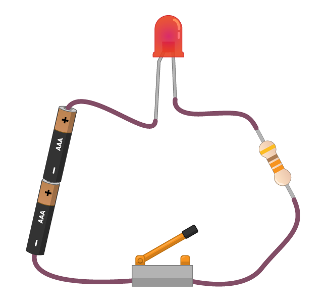

A imagem em baixo mostra um circuito muito simples. Existem quatro componentes, todos ligados com fios.

1. A célula (ou bateria) fornece energia ao circuito na forma de eletricidade. Uma célula tem um lado positivo e um negativo. A energia elétrica (ou corrente) flui do lado positivo para o lado negativo da célula. Em vez de usar uma célula, também podes fornecer energia a este circuito com um Raspberry Pi em execução!

1. O ** l ** ight- ** e ** ** d ** O iodo (LED - Diodo emissor de Luz) é um tipo de componente de saída. Quando a corrente flui através do LED, ele emite luz. Diferentes LEDs podem produzir diferentes cores de luz, e alguns podem até produzir várias cores.

1. A resistência ajuda a proteger o LED. As resistências consomem parte da energia da célula e, portanto, reduzem a quantidade de energia que chega ao LED. Sem a resistência, o LED pode queimar, da mesma maneira que um fusível pode queimar num dos teus eletrodomésticos.

1. O interruptor atua como uma interrupção no circuito. Quando o interruptor está aberto, nenhuma corrente pode fluir através do LED e da resistência. Quando o interruptor está fechado, o circuito está completo e a corrente pode fluir, fazendo com que o LED acenda.
