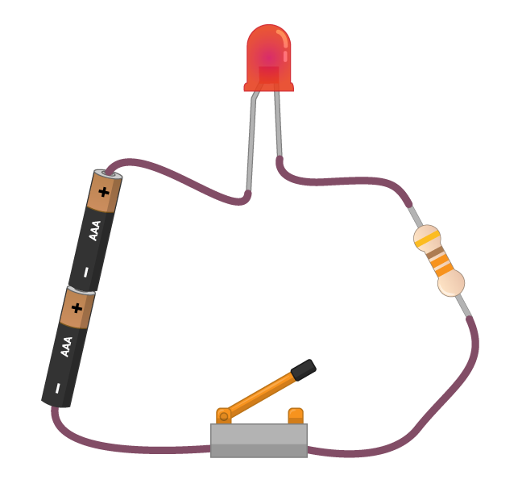

Нижченаведене зображення показує дуже просте електричне коло. В ньому є чотири компоненти, з’єднані проводами.

1. Елемент живлення (або батарея) постачає енергію в коло у формі електрики. Батарея має позитивну та негативну сторони. Електрична енергія (або струм) протікає від позитивної до негативної сторони батареї. Замість використання батареї ти можеш забезпечити це коло енергією від запущеного Raspberry Pi!

1. Світлодіод (**l**ight-**e**mitting **d**iode або LED) — один із типів компонентів виводу. Коли струм протікає через світлодіод, він випромінює світло. Різні світлодіоди можуть давати різні кольори світла, а деякі навіть можуть створювати декілька кольорів.

1. Резистор допомагає захистити світлодіод. Резистори витрачають деяку кількість енергії із батареї і таким чином зменшують кількість енергії, яка досягає світлодіода. Без резистора світлодіод міг би згоріти так само, як може згоріти запобіжник в якомусь із твоїх побутових приладів.

1. Вимикач діє як розрив у колі. Коли вимикач розімкнуто, струм не протікає через світлодіод та резистор. Коли вимикач замкнуто, електричне коло є замкненим, і струм може в ньому протікати, спричиняючи вмикання світлодіода.
