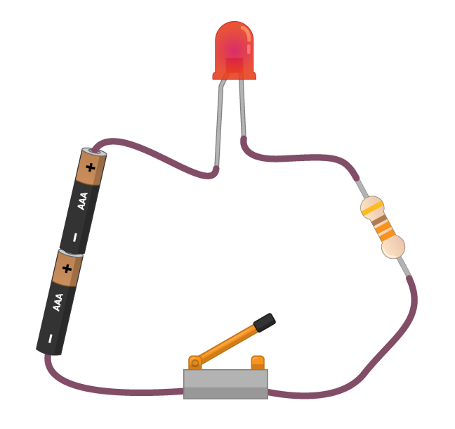

下图显示了一个非常简单的电路。 有四个元件，所有组件均通过电线连接。

1. 电池为电路提供电能。 电池具有正负两极。 电能(或电流)从电池的正极向负极流动。 除了使用电池，您还可以通过运行的Raspberry Pi为该电路提供能量！

1. **l**ight-**e**mitting** d**iode (LED, 发光二极管) 是一种输出元件。 当电流流过LED时，它会发光。 不同的 LED 可以发出不同颜色的光，有些甚至可以发出多种颜色的光。

1. 电阻用于保护LED。 电阻消耗掉了一些从电池发出的能量，因此 LED 接收到的能量就减少了。 如果没有电阻，LED 可能会烧毁，就像家里的保险丝被烧坏一样。

1. 开关充当电路中的断路。 当开关断开时，没有电流流过 LED 和电阻。 当开关闭合时，电路形成回路并且有电流流动，从而导致 LED 发光。
